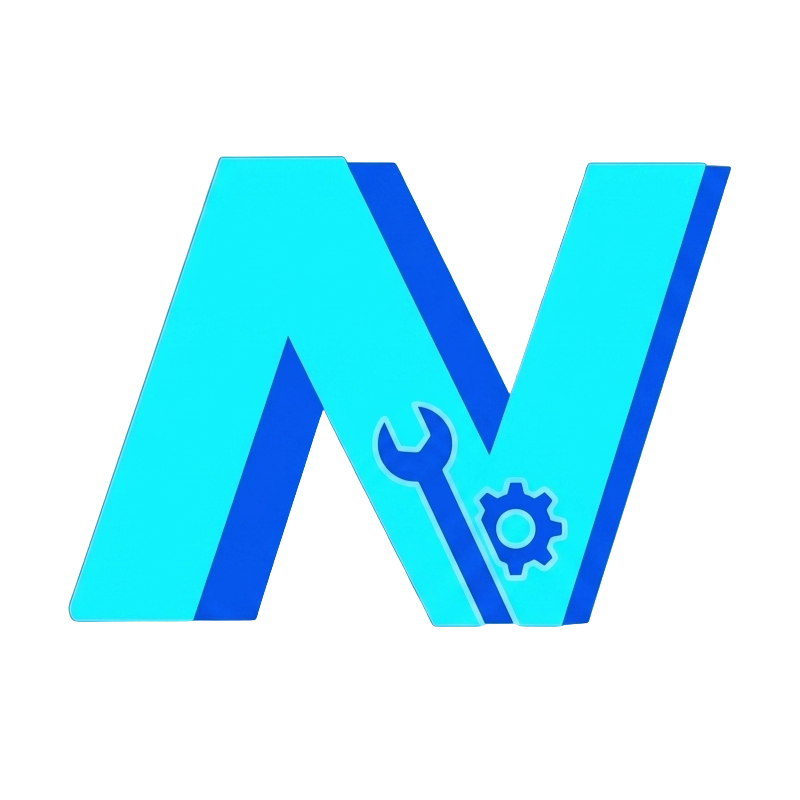

<p align="center">
  
</p>

<h1 align="center">Neodash Modding Guide</h1>

<p align="center">
  Community documentation for installing mods and understanding Neodash's Unreal Engine content.
</p>

## What this project contains

This repository contains the Astro and Starlight documentation site for Neodash modding.

The guide currently covers:

- Installing UE4SS for Neodash.
- Installing the CustomServer Lua mod.
- Runtime scripting and inspection.
- Classic UE4 Pak overrides.
- Verified game files, paths, and engine information.

Start with the [Custom Server guide](src/content/docs/guides/custom-server.md), or read the [Game Findings reference](src/content/docs/reference/game-findings.md).

## Run the site locally

Use [Bun](https://bun.sh/) from the repository root:

```sh
bun install
bun run dev
```

Open `http://localhost:4321` in your browser.

## Build and preview

Create a production build and preview it locally:

```sh
bun run build
bun run preview
```

The generated site is written to `dist/`.

## Project structure

```text
.
├── public/                  Static files, such as the favicon
├── src/
│   ├── assets/              Images processed by Astro
│   ├── content/docs/        Markdown and MDX documentation
│   └── styles/              Site-wide styles
├── astro.config.mjs         Astro and Starlight configuration
├── package.json             Scripts and dependencies
└── tsconfig.json            TypeScript configuration
```

Add documentation pages under `src/content/docs/`. Starlight uses each page's frontmatter to generate its title, description, and route.

## Development commands

| Command | Purpose |
| --- | --- |
| `bun install` | Install dependencies |
| `bun run dev` | Start the local development server |
| `bun run build` | Validate and build the production site |
| `bun run preview` | Preview the production build locally |
| `bun run astro -- --help` | Show Astro CLI help |

## Scope and accuracy

Neodash is built with Unreal Engine 4.26.2. Modding instructions should be tested against the recorded Steam build and the specific UE4SS version being used.

This is community-authored documentation and is not affiliated with Axan Gray.
